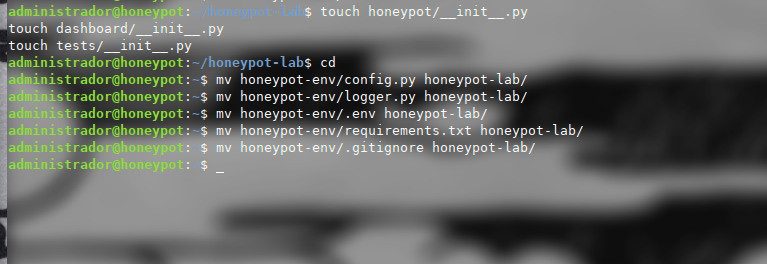
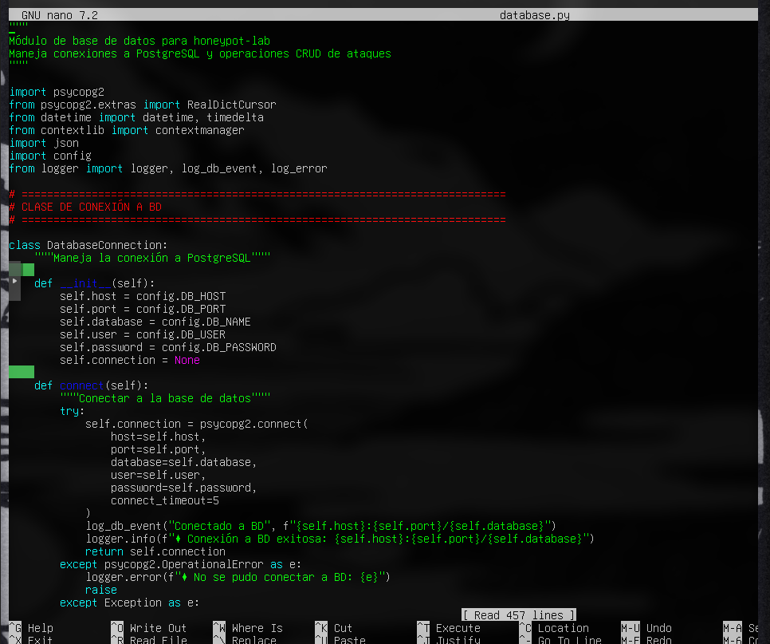
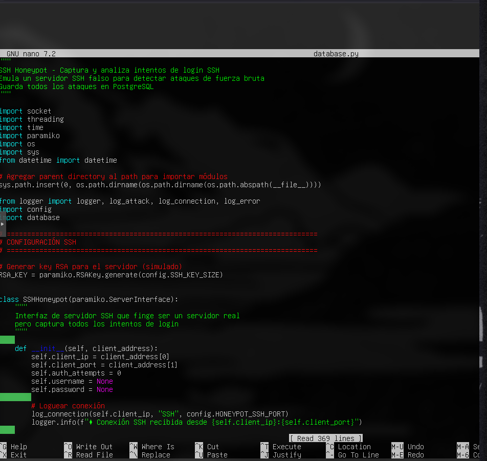
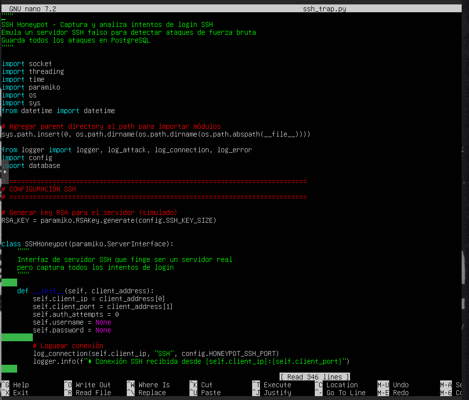
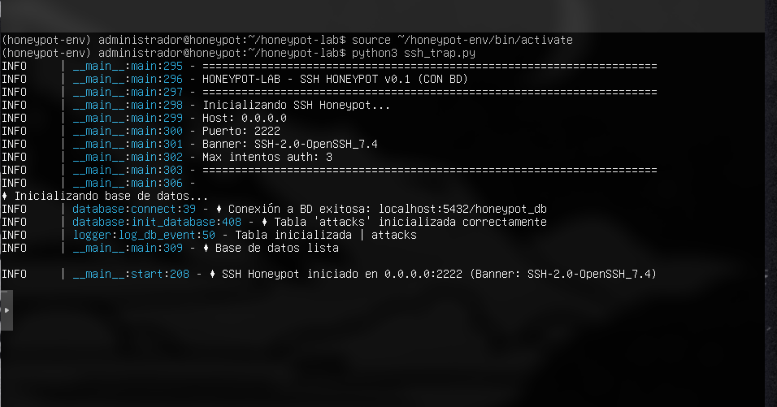
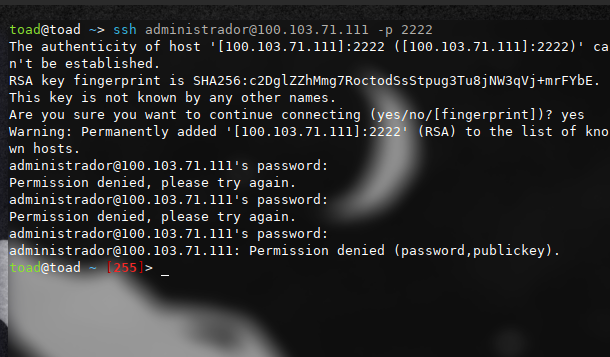
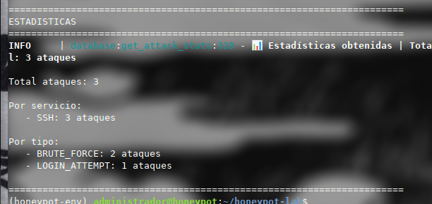
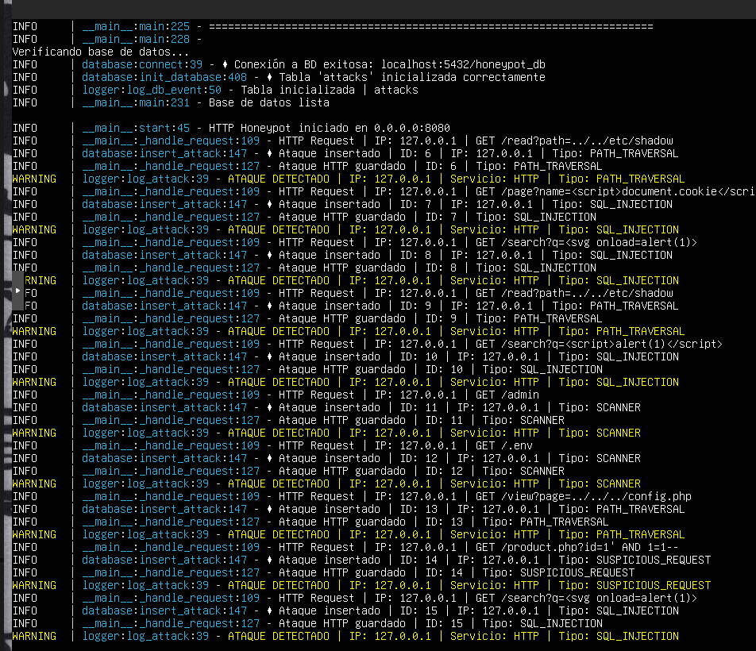
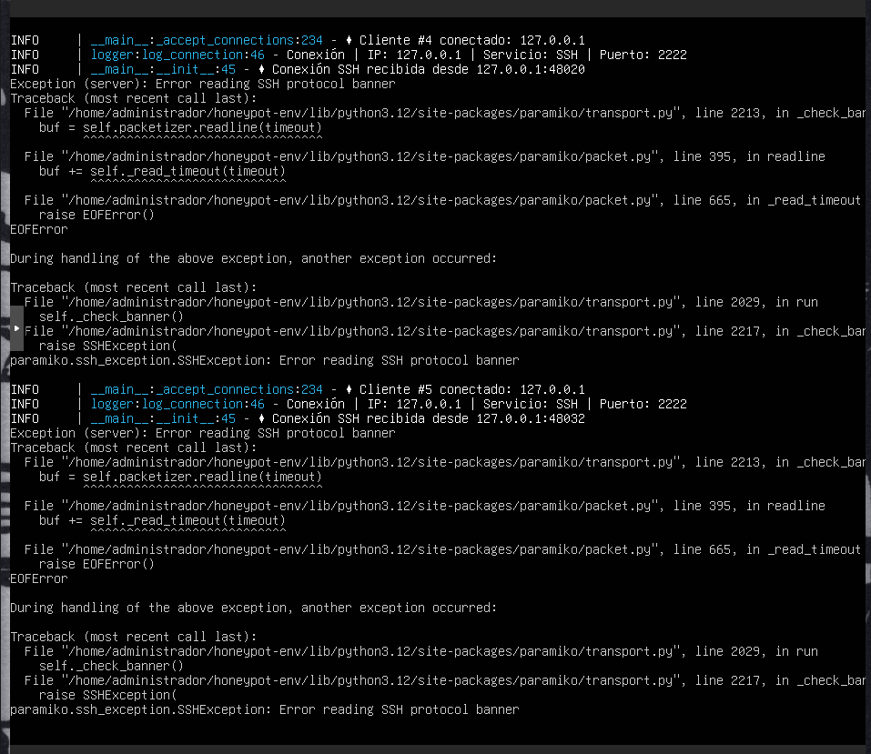

# Documentación Técnica — Honeypot Lab

---

!Atencion: todo el condigo en python de este proyecto esta hecho con IA para facilitar la velocidad de este trabajo, usese solo en entornos controlados o con fines eticos y educativos, gracias¡

## 1. Creación de la máquina virtual en Proxmox

### 1.1 Configuración general


En la interfaz de Proxmox se crea una nueva máquina virtual. Se asigna el nodo **pve2**, el identificador **VM ID 101** y el nombre **honeypot**. Este nombre identifica la máquina dentro del clúster.

---

### 1.2 Sistema operativo


Se selecciona la imagen ISO almacenada en local para instalar el sistema operativo. El tipo de SO configurado es **Linux**, versión de kernel **6.x - 2.6**, usando una imagen live-server para arquitectura amd64.

---

### 1.3 Disco duro


Se configura un disco virtual de **40 GiB** usando el bus SCSI con controlador **VirtIO SCSI single**, almacenado en **local-lvm**. Se activa la opción **IO thread** para mejorar el rendimiento de entrada/salida.

---

### 1.4 CPU


Se asigna **1 zócalo con 3 núcleos** de tipo **x86-64-v2-AES**, resultando en un total de 3 núcleos disponibles para la máquina virtual.

---

### 1.5 Memoria RAM


Se configura **4086 MiB** (aproximadamente 4 GB) de memoria RAM para la máquina virtual.

---

## 2. Instalación de Ubuntu Server

### 2.1 Configuración del perfil de usuario


Durante el proceso de instalación de Ubuntu Server, se configura el perfil del sistema. Se establece el nombre real **administrador**, el nombre del servidor **honeypot**, el nombre de usuario **administrador** y una contraseña. Este usuario tendrá capacidad para ejecutar comandos con `sudo`.

---

### 2.2 Configuración de SSH durante la instalación


En el paso de configuración SSH del instalador se selecciona **instalar el servidor OpenSSH** y se habilita la **autenticación por contraseña**. No se importa ninguna clave SSH adicional. Esto permite acceso remoto a la máquina una vez finalizada la instalación.

---

## 3. Configuración del sistema

### 3.1 Instalación de herramientas del sistema


Desde el terminal del servidor, con el usuario `administrador@honeypot`, se ejecuta `sudo apt install -y` para instalar las siguientes utilidades del sistema: **git, curl, wget, nano, vim, htop, net-tools, build-essential** y **software-properties-common**. Estas herramientas son necesarias para gestionar el servidor, compilar dependencias y depurar el entorno.

---

### 3.2 Instalación de Python 3.12 dev y venv


Se instala **python3.12-venv** y **python3.12-dev** mediante `apt`. El gestor de paquetes resuelve las dependencias necesarias: `libexpat1-dev`, `libpython3.12-dev`, `python3-pip-whl`, `python3-setuptools-whl` y `zlib1g-dev`. En total se descargan 9.6 MB y se utilizan 35.2 MB de espacio en disco.

---

### 3.3 Creación del entorno virtual e instalación de dependencias Python


Se crea el entorno virtual en `~/honeypot-env` con `python3 -m venv` y se activa con `source ~/honeypot-env/bin/activate`. A continuación se actualiza **pip** de la versión 24.0 a la **26.1.1** y se instalan las librerías principales del proyecto: **flask, paramiko, psycopg2-binary, sqlalchemy, python-dotenv, loguru** y **requests**.

---

### 3.4 Verificación de dependencias


Se ejecuta `python -c "import flask, paramiko, psycopg2, sqlalchemy, loguru, requests"` y el resultado es **"todo funciona perfectamente"**. A continuación se lista con `pip list` todos los paquetes instalados en el entorno: flask 3.1.3, paramiko 5.0.0, psycopg2-binary 2.9.12, SQLAlchemy 2.0.49, loguru 0.7.3, requests 2.34.2, entre otros.

---

### 3.5 Instalación de dependencias adicionales


Se instalan paquetes adicionales orientados a análisis de red y testing: **geoip2, maxminddb, scapy, dnspython, pycryptodome, pytest** y **pytest-cov**. Estas librerías amplían las capacidades del honeypot para análisis de tráfico y ejecución de tests automatizados.

---

## 4. Estructura del proyecto

### 4.1 Creación de ficheros de configuración


Con el editor `nano` se crean los ficheros principales del proyecto dentro del directorio `~/honeypot-env`: **config.py**, **logger.py**, **.env**, **requirements.txt** y **.gitignore**. Además se crea el fichero `honeypot/__init__.py` para convertir el directorio en un módulo Python.

---

### 4.2 Organización de módulos y traslado de ficheros



Se crean los ficheros `__init__.py` en los directorios **honeypot/**, **dashboard/** y **tests/**, estableciendo la estructura de módulos del proyecto. Posteriormente se mueven todos los ficheros de configuración desde `~/honeypot-env/` al directorio definitivo `~/honeypot-lab/` usando el comando `mv`.

---

## 5. Base de datos PostgreSQL

### 5.1 Instalación de PostgreSQL


Se instala **postgresql** y **postgresql-contrib** con `sudo apt install`. El gestor de paquetes descarga 43.6 MB e instala 13 paquetes nuevos incluyendo las librerías cliente, el servidor principal y las extensiones adicionales.

---

### 5.2 Arranque y habilitación del servicio


Se inicia el servicio con `sudo systemctl start postgresql` y se habilita para que arranque automáticamente con `sudo systemctl enable postgresql`. Al consultar el estado con `systemctl status postgresql`, se confirma que el servicio está en estado **active (exited)** con preset habilitado, arrancado el 2026-05-24 a las 20:18:26 UTC.

---

### 5.3 Creación de la base de datos


Accediendo al cliente psql con `sudo -u postgres psql`, se ejecuta el comando `CREATE DATABASE honeypot_db;`. PostgreSQL confirma la operación con el mensaje **CREATE DATABASE**. La versión instalada es PostgreSQL 16.14 (Ubuntu 16.14-0ubuntu0.24.04.1).

---

### 5.4 Creación del usuario y asignación de privilegios


Se crea el usuario de base de datos con `CREATE USER honeypot_user WITH PASSWORD 'ejemplo';` — PostgreSQL responde **CREATE ROLE**. Se ajusta la codificación del cliente con `ALTER ROLE honeypot_user SET client_encoding TO 'utf8'`. Se produce un error tipográfico al escribir `PRIVILEGIES` en lugar de `PRIVILEGES`, que se corrige en la siguiente sentencia: `GRANT ALL PRIVILEGES ON DATABASE honeypot_db TO honeypot_user;` — el servidor confirma con **GRANT**.

---

### 5.5 Módulo de conexión a base de datos — database.py



Se muestra en el editor `nano` el fichero **database.py**, que contiene la clase `DatabaseConnection` responsable de gestionar la conexión a PostgreSQL mediante **psycopg2**. La clase lee la configuración del host, puerto, nombre de BD, usuario y contraseña desde el módulo `config`. El método `connect()` establece la conexión con un timeout de 5 segundos, registra el evento con `log_db_event` y lanza una excepción si la conexión falla.

---

## 6. SSH Honeypot

### 6.1 Código del módulo ssh_trap.py




Se muestra el código del fichero **ssh_trap.py** abierto en nano. El módulo implementa un servidor SSH falso usando la librería **paramiko**. Al inicio genera una clave RSA para el servidor simulado. La clase `SSHHoneypot` hereda de `paramiko.ServerInterface` y actúa como si fuera un servidor SSH real, pero registra cada conexión entrante: almacena la IP del cliente, el puerto, el número de intentos de autenticación y las credenciales probadas. Cada conexión se registra con `log_connection` al instanciarse.

---

### 6.2 Arranque del SSH Honeypot



Con el entorno virtual activado, se ejecuta `python3 ssh_trap.py`. La salida de logs muestra la secuencia de inicio:

- **HONEYPOT-LAB — SSH HONEYPOT v0.1 (CON BD)**
- Host: `0.0.0.0`, Puerto: `2222`, Banner: `SSH-2.0-OpenSSH_7.4`, Máx. intentos de autenticación: `3`
- Conexión exitosa a la BD: `localhost:5432/honeypot_db`
- Tabla `attacks` inicializada correctamente
- **SSH Honeypot iniciado en `0.0.0.0:2222`**

El honeypot queda en escucha en el puerto 2222 de todas las interfaces de red.

---

### 6.3 Intento de conexión SSH desde el atacante



Desde una máquina externa (`toad@toad`) se ejecuta `ssh administrador@100.103.71.111 -p 2222`. El cliente SSH muestra la huella RSA del servidor honeypot (`SHA256:c2DglZZhMmg7RoctodSsStpug3Tu8jNW3qVj+mrFYbE`) y pregunta si se desea continuar — se acepta. Se realizan **3 intentos de contraseña**, todos respondidos con `Permission denied`. Finalmente el cliente recibe `Permission denied (password,publickey)` y la conexión se cierra. El atacante no obtiene acceso al sistema real.

---

### 6.4 Captura y clasificación del ataque SSH


En el terminal del honeypot se registra en tiempo real el ataque procedente de `100.111.145.79`:

- **Cliente #1 conectado** — se recibe la conexión en el puerto 2222.
- **ID 1** — primer intento: `LOGIN_ATTEMPT`, usuario `administrador` — insertado en BD.
- **ID 2** — segundo intento: clasificado como `BRUTE_FORCE` — guardado en BD.
- **ID 3** — tercer intento: `BRUTE_FORCE` — guardado en BD.
- Nivel **CRITICAL**: `BRUTE FORCE CRÍTICO DETECTADO | IP: 100.111.145.79 | Intentos: 3` — se eleva la alerta al alcanzar el umbral máximo de intentos.

---

### 6.5 Estadísticas de ataques SSH



El módulo de estadísticas muestra el resumen de los ataques registrados hasta ese momento en la base de datos:

- **Total ataques: 3**
- Por servicio — SSH: 3 ataques
- Por tipo — BRUTE\_FORCE: 2 ataques, LOGIN\_ATTEMPT: 1 ataque

---

## 7. HTTP Honeypot

### 7.1 Código del módulo http_trap.py


Se muestra el fichero **http_trap.py** en el editor nano. El módulo implementa la clase `HTTPHoneypot`, que levanta un servidor HTTP usando sockets de bajo nivel (`socket.AF_INET`, `socket.SOCK_STREAM`). El servidor escucha en el host y puerto configurados (por defecto el `HONEYPOT_HTTP_PORT` del módulo `config`), admite hasta 100 conexiones en cola y registra cada petición entrante. Su descripción indica que detecta **SQL injection, XSS, path traversal** y otros ataques HTTP, guardándolos en PostgreSQL.

---

### 7.2 Arranque del HTTP Honeypot


Con el entorno virtual activado se ejecuta `python3 http_trap.py`. La secuencia de inicio es:

- **HONEYPOT-LAB — HTTP HONEYPOT v0.1**
- Host: `0.0.0.0`, Puerto: `8000`
- Conexión exitosa a la BD: `localhost:5432/honeypot_db`
- Tabla `attacks` inicializada correctamente
- **HTTP Honeypot iniciado en `0.0.0.0:8080`**

El servidor queda a la escucha en el puerto 8080.

---

### 7.3 Ataque XSS manual con curl


Desde la misma máquina se lanza manualmente un ataque XSS usando `curl`:

```
curl "http://localhost:8080/search?q=<script>alert(1)</script>"
```

El honeypot responde con `<html><body><h1>Welcome</h1></body></html>`, simulando ser un servidor web legítimo para no delatar que es una trampa. El atacante recibe una respuesta HTTP 200 aparentemente normal.

---

### 7.4 Detección y registro del ataque XSS


El honeypot registra internamente la petición:

- **HTTP Request** — IP: `127.0.0.1` | GET `/search?q=<script>alert(1)</script>`
- Ataque insertado en BD con **ID: 4**, tipo clasificado como **SQL\_INJECTION**
- WARNING: `ATAQUE DETECTADO | IP: 127.0.0.1 | Servicio: HTTP | Tipo: SQL_INJECTION`

El payload XSS es detectado aunque el motor de clasificación lo etiqueta como `SQL_INJECTION`, lo que indica que el patrón de detección agrupa ambos tipos bajo la misma categoría en esta versión.

---

## 8. Simulador de ataques

### 8.1 Código del simulador — simulate_atacks.py


Se muestra el fichero **simulate\_atacks.py** en nano. El simulador apunta a `localhost` en los puertos `2222` (SSH) y `8080` (HTTP). Define diccionarios de prueba para SSH: lista de usuarios comunes (`admin`, `root`, `test`, `administrator`, `postgres`, `ubuntu`…) y contraseñas débiles (`admin`, `password`, `123456`, `qwerty`…). Para HTTP define payloads organizados por categoría: **SQL\_INJECTION** (inyecciones clásicas con `OR '1'='1'`, `UNION SELECT`, `DROP TABLE`), **XSS** (payloads `<script>`, ``, `<svg onload>`), **PATH\_TRAVERSAL** (`../../../etc/passwd`, `../etc/shadow`) y peticiones a rutas sensibles de **SCANNER**.

---

### 8.2 Menú del simulador de ataques


Se ejecuta `python3 tests/simulate_atacks.py` desde el directorio `~/honeypot-lab`. El simulador presenta un menú interactivo con las siguientes opciones:

1. Simular ataque SSH (fuerza bruta)
2. Simular ataques HTTP (SQL, XSS, etc.)
3. Simular ataques mixtos (SSH + HTTP)
4. Ataque rápido (5 SSH + 10 HTTP)
5. Estrés test (100 requests)
0. Salir

---

### 8.3 Ejecución del ataque rápido (opción 4)


Se selecciona la opción **4 — Ataque rápido**. El simulador lanza 5 intentos SSH y 10 peticiones HTTP. En esta ejecución ambos servicios responden con **`[Errno 111] Connection refused`** porque los honeypots no estaban en ejecución en ese momento. El simulador registra la simulación como completada mostrando: `SQL_INJECTION: 0 requests`, `XSS: 0 requests`, `PATH_TRAVERSAL: 0 requests`, `SCANNER: 0 requests`.

---

### 8.4 HTTP Honeypot procesando múltiples ataques simulados



Con el HTTP Honeypot activo, el simulador genera una ráfaga de peticiones maliciosas desde `127.0.0.1`. El honeypot detecta y registra en BD los siguientes ataques en secuencia:

| ID | Tipo | Ruta |
|----|------|------|
| 6  | PATH\_TRAVERSAL | `/read?path=../../etc/shadow` |
| 7  | SQL\_INJECTION | `/page?name=<script>document.cookie</script>` |
| 8  | SQL\_INJECTION | `/search?q=<svg onload=alert(1)>` |
| 9  | PATH\_TRAVERSAL | `/read?path=../../etc/shadow` |
| 10 | SQL\_INJECTION | `/search?q=<script>alert(1)</script>` |
| 11 | SCANNER | `/admin` |
| 12 | SCANNER | `/.env` |
| 13 | PATH\_TRAVERSAL | `/view?page=../../../config.php` |
| 14 | SUSPICIOUS\_REQUEST | `/product.php?id=1' AND 1=1--` |
| 15 | SQL\_INJECTION | `/search?q=<svg onload=alert(1)>` |

Cada ataque genera una línea WARNING en los logs del honeypot con la IP origen, el servicio y el tipo detectado.

---

### 8.5 SSH Honeypot recibiendo conexiones del simulador



El SSH Honeypot recibe conexiones desde `127.0.0.1` generadas por el simulador. Los clientes #4 y #5 se conectan al puerto 2222 pero no completan el handshake SSH correctamente, produciendo la excepción `paramiko.ssh_exception.SSHException: Error reading SSH protocol banner`. Esta excepción indica que la conexión se establece a nivel TCP pero el cliente (el simulador) no envía el banner SSH estándar, lo que interrumpe el intercambio del protocolo. El honeypot registra cada conexión entrante antes de producirse el error.

---

**Proyecto hecho por Jairo Mosteiro**