# Instalación Visual - Honeypot Lab

Documentación del proceso de instalación con capturas visuales.

---

## Paso 1: Asignación de Memoria

Se configura la máquina virtual con **4 GB de RAM** para que tenga suficientes recursos para ejecutar PostgreSQL, los honeypots y el sistema operativo simultáneamente.

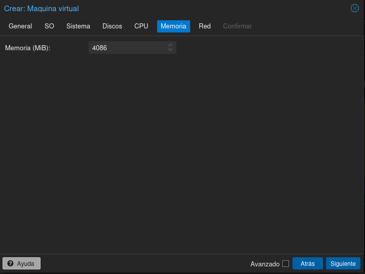

---

## Paso 2: Configuración de CPU

Se asigna **3 núcleos de CPU** en el tipo x86-64-v2-AES, proporcionando poder de procesamiento adecuado para manejar múltiples conexiones simultáneas de atacantes.

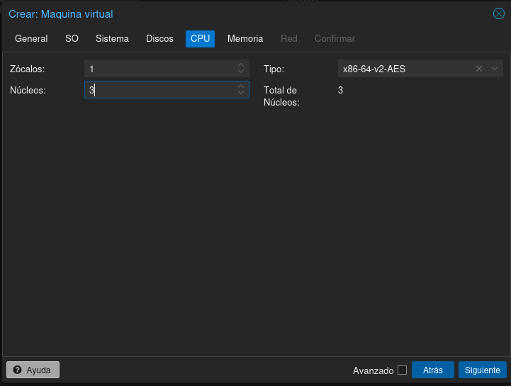

---

## Paso 3: Configuración de Disco

Se crea un disco virtual de **40 GB** con almacenamiento local en Proxmox. Este espacio es suficiente para el SO, PostgreSQL y los logs del honeypot.

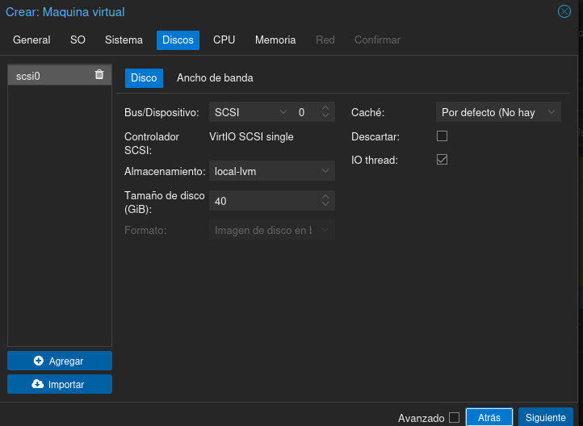

---

## Paso 4: Selección del Sistema Operativo

Se elige **Ubuntu Server 22.04 LTS** como sistema operativo base. Esta distribución es estable, tiene soporte a largo plazo y amplio soporte comunitario para herramientas de seguridad.

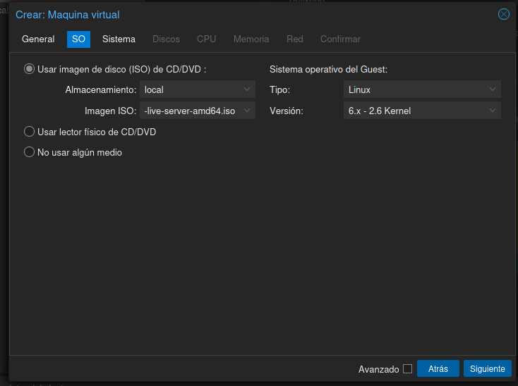

---

## Paso 5: Información General de la VM

Se define el nombre de la máquina como **"honeypot"** con ID 101 en el nodo Proxmox. Esto permite identificarla fácilmente en la infraestructura.

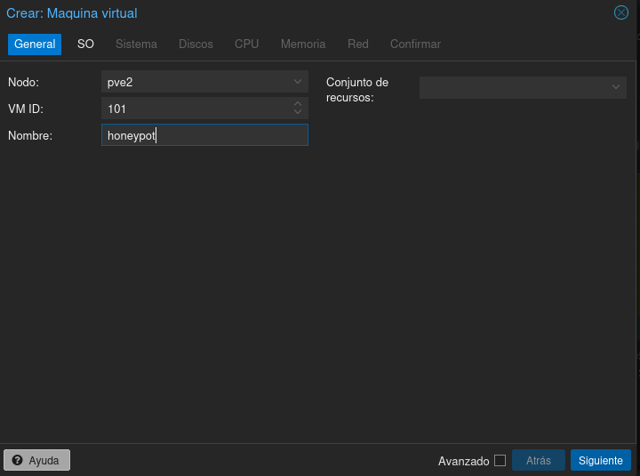

---

## Paso 6: Instalación de OpenSSH

Durante la instalación de Ubuntu, se selecciona instalar **OpenSSH Server** para permitir acceso remoto por SSH a la máquina. Esto es útil para gestionar el honeypot desde otras máquinas.

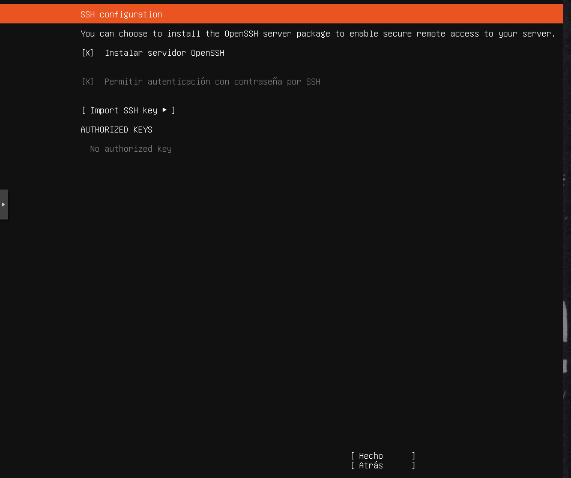

---

## Paso 7: Configuración del Usuario

Se crea el usuario **"administrador"** con contraseña. Este usuario tendrá permisos sudo para instalar dependencias y configurar los servicios del honeypot.

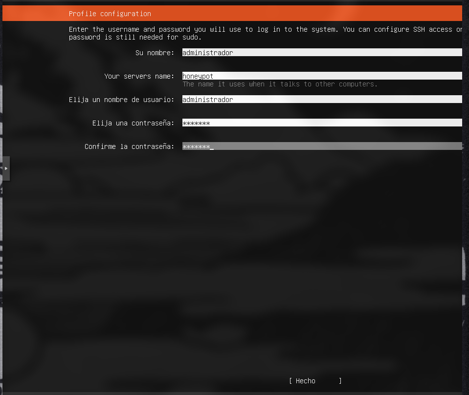

---

## Paso 8: Instalación de PostgreSQL

Se instala **PostgreSQL** ejecutando el comando apt. PostgreSQL es necesario para almacenar todos los ataques capturados por los honeypots en una base de datos relacional.

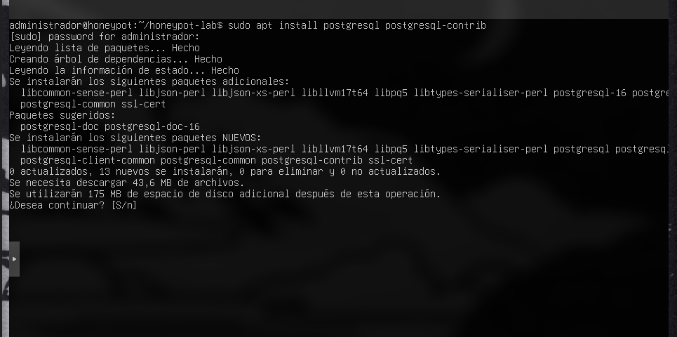

---

## Paso 9: Verificar PostgreSQL Activo

Se verifica que el servicio PostgreSQL esté **activo y ejecutándose**. Un estado "Active: active (running)" confirma que la base de datos está lista para recibir conexiones.

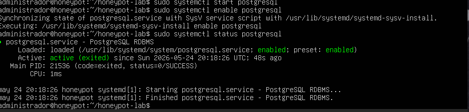

---

## Paso 10: Instalar Herramientas Adicionales

Se instala **postgresql-contrib** que proporciona herramientas y extensiones adicionales para PostgreSQL que pueden ser útiles para administración.

---

## Paso 11: Crear Base de Datos

Se crea la base de datos **"honeypot_db"** en PostgreSQL. Esta BD almacenará todos los registros de ataques capturados por los honeypots.

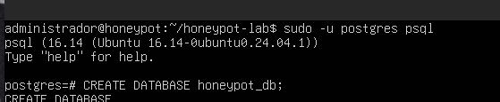

---

## Paso 12: Crear Usuario de Base de Datos

Se crea el usuario **"honeypot_user"** en PostgreSQL con contraseña. Este usuario será utilizado por los honeypots para conectarse a la base de datos de forma segura.

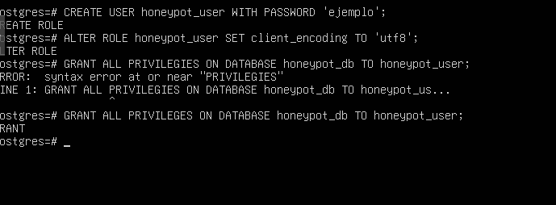

---

## Paso 13: Crear Estructura del Proyecto

Se crean los directorios y archivos iniciales del proyecto. Se organizan los módulos en carpetas separadas (honeypot, dashboard, tests) y se copian los archivos de configuración necesarios.

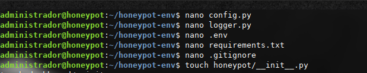

---

## Paso 14: Instalar Herramientas del Sistema

Se instalan herramientas de utilidad del sistema que pueden ser necesarias para que ciertos paquetes Python compilen correctamente.

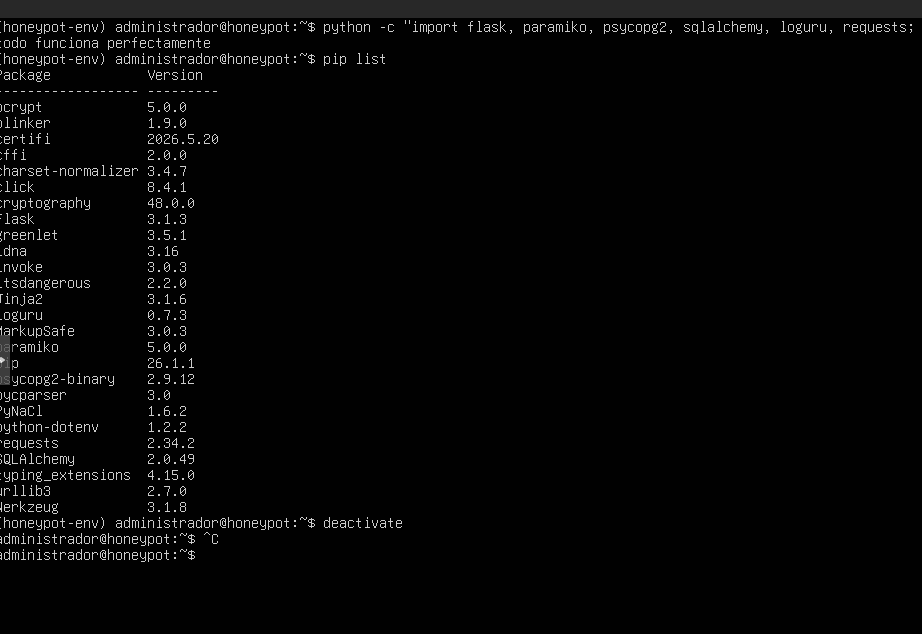

---

## Paso 15: Verificar Dependencias Python

Se lista todos los paquetes Python instalados. Se pueden ver librerías críticas como Flask, Paramiko, psycopg2, Loguru y Requests que son necesarias para el proyecto.

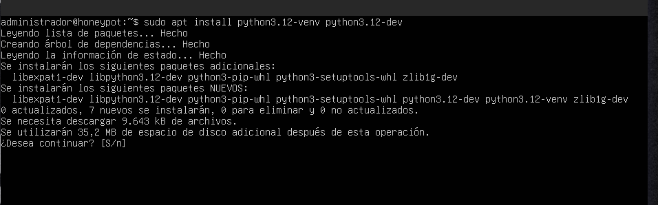

---

## Paso 16: Actualizar pip

Se actualiza **pip** (gestor de paquetes Python) a la versión más reciente. Esto asegura que se instalen correctamente todas las dependencias del proyecto.

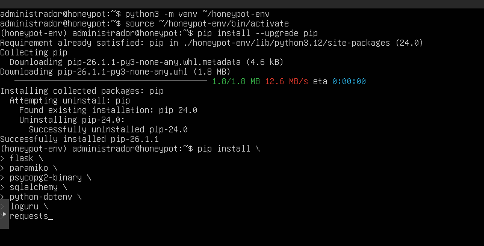

---

## Paso 17: Instalar Python 3.12 Dev

Se instalan los **headers de desarrollo de Python 3.12**. Esto es necesario para compilar módulos nativos de algunos paquetes como psycopg2.

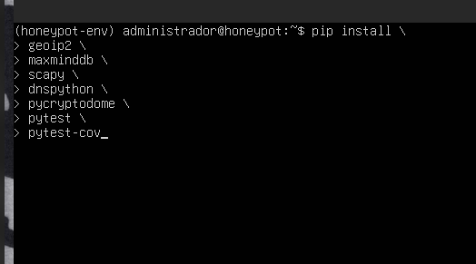

---

## Paso 18: Instalar Utilidades Básicas

Se instalan herramientas del sistema como **git, curl, nano, vim, htop** y otras. Estas son fundamentales para desarrollo, debugging y monitoreo del servidor.

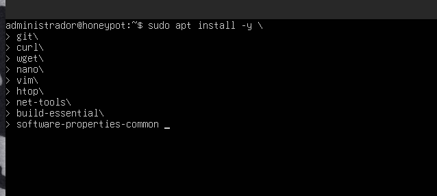

---

---

## Paso 19: SSH Honeypot Funcionando

El **SSH Honeypot se inicia correctamente** en puerto 2222 y comienza a aceptar conexiones. Se ve que la BD está lista y se registran múltiples conexiones de atacantes. Cada intento de login se captura y se clasifica por tipo de ataque (LOGIN_ATTEMPT, BRUTE_FORCE).

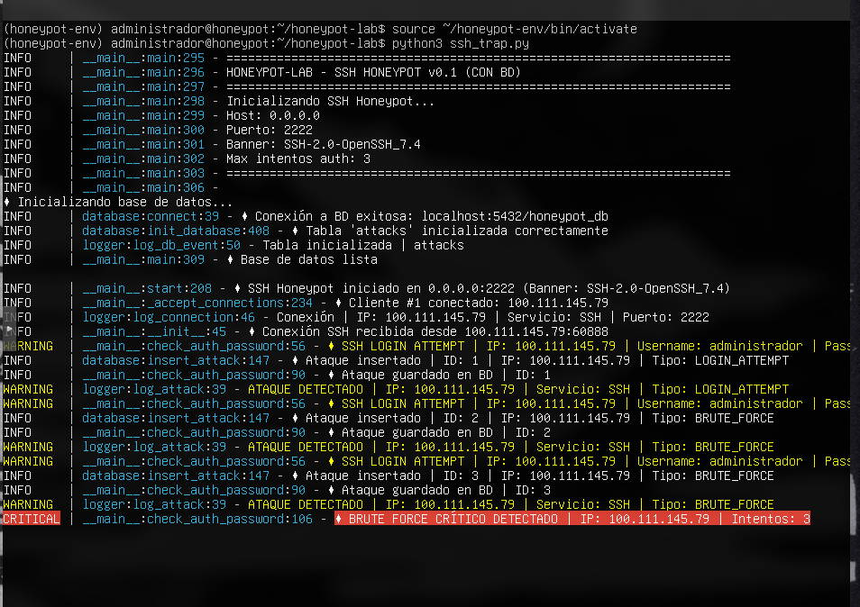

---

## Paso 20: HTTP Honeypot Capturando Ataques

El **HTTP Honeypot se inicia** en puerto 8080 y comienza a detectar ataques. Se capturan diversos tipos de ataques: PATH_TRAVERSAL, SQL_INJECTION, XSS. Cada ataque se inserta en la BD con un ID único y tipo de amenaza.

---

## Paso 21: Menú del Simulador de Ataques

El **simulador de ataques** presenta un menú interactivo con 6 opciones diferentes. Permite generar ataques SSH, HTTP, mixtos o ejecutar tests de stress sin exponerse a ataques reales.

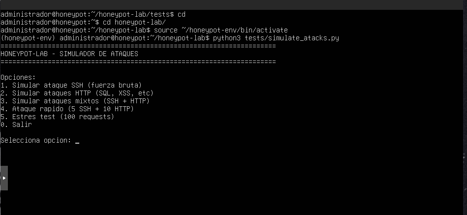

---

## Paso 22: Ejecutar Test Rápido

Se ejecuta la **opción 4 (quick test)** que genera 5 ataques SSH y 10 ataques HTTP automáticamente. Esto llena la base de datos con datos de prueba para validar que los honeypots capturan correctamente.

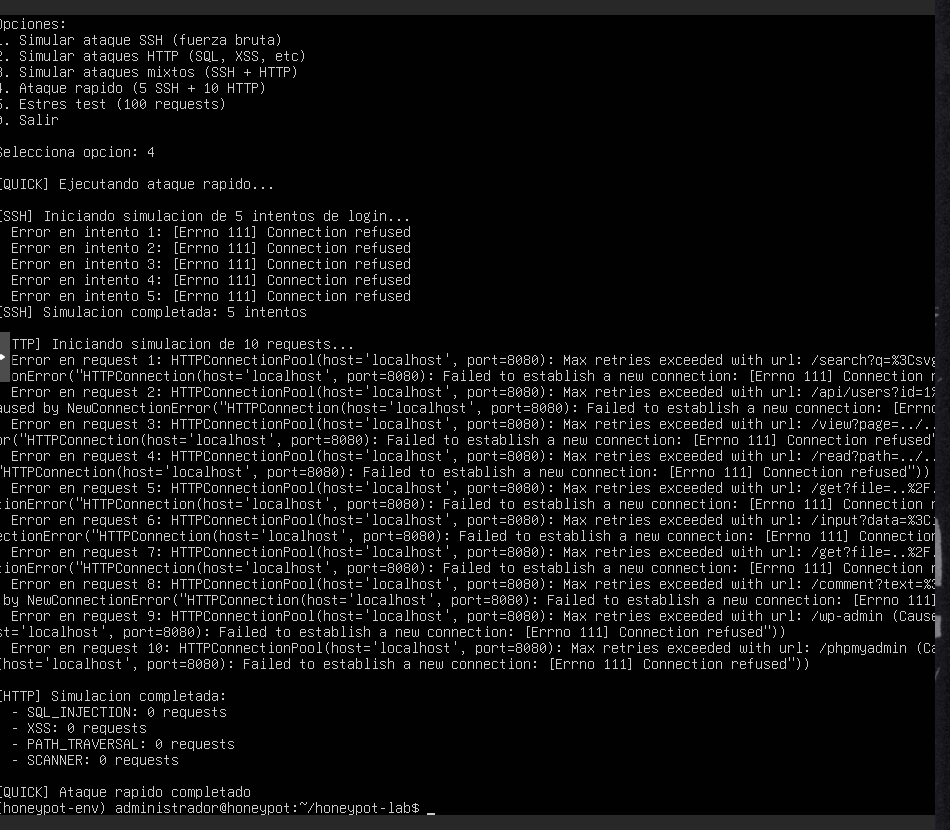

---

## Paso 23: Código del Simulador

Se muestra el código del **simulador de ataques** que contiene configuración, diccionarios de usuarios/contraseñas para SSH y payloads de ataques web (SQL injection, XSS, path traversal, scanners).

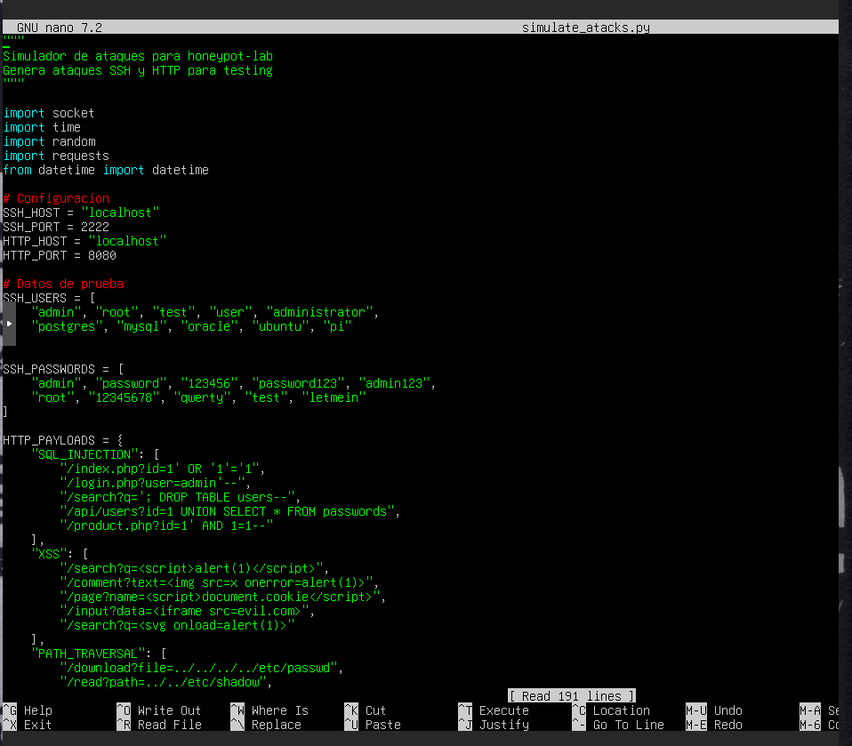

---

## Paso 24: HTTP Honeypot en Puerto 8080

Se confirma que el **HTTP Honeypot está ejecutándose** en puerto 8080 con acceso a BD. Está listo para capturar ataques web.

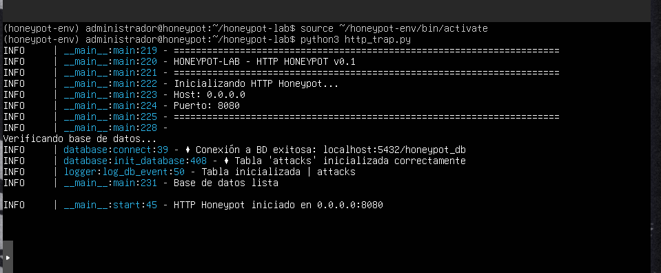

---

## Paso 25: Ejecutar Ataque XSS con curl

Desde terminal se ejecuta un **ataque XSS** usando curl contra el honeypot HTTP. El honeypot responde con 200 OK, engañando al atacante de que el servidor es real.

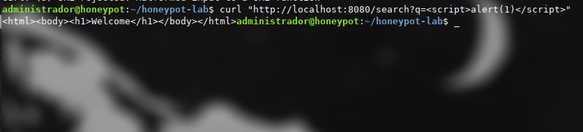

---

## Paso 26: HTTP Honeypot Detecta Ataque

El honeypot **detecta y registra el ataque XSS** en los logs y lo inserta en la BD con ID único. Se identifica como ataque de tipo SQL_INJECTION (puede haber falsa clasificación en este caso).

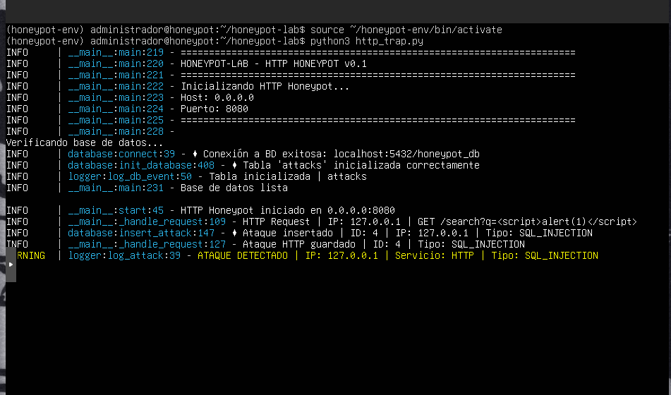

---

## Paso 27: Código HTTP Honeypot

Se muestra el código del **HTTP Honeypot** que implementa un servidor HTTP que captura requests, detecta patrones maliciosos y almacena los ataques en PostgreSQL usando la clase HTTPHoneypot.

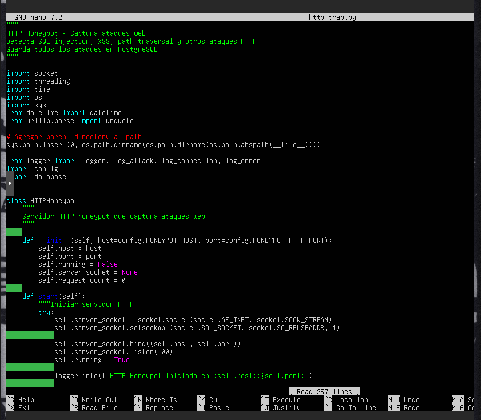

---

**Instalación completada exitosamente**